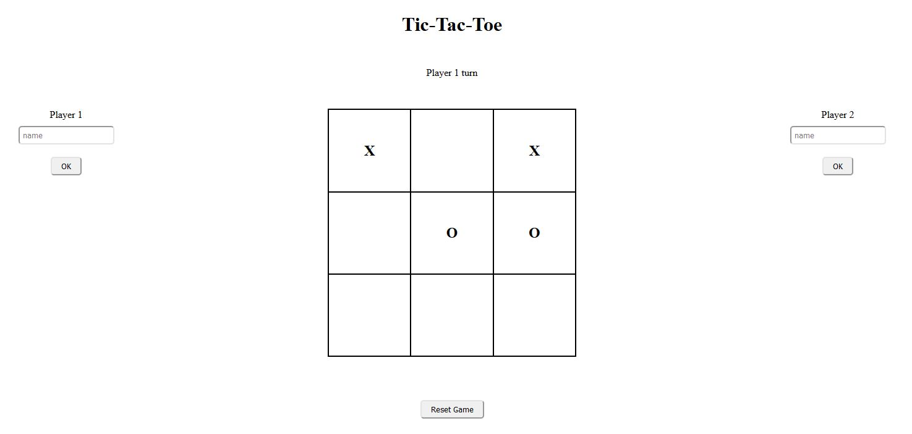

# Odin Project - Tic-Tac-Toe
Odin Project || Tic Tac Toe

## Table of contents
- [Overview](#overview)
  - [Links](#links)
  - [Built with](#built-with)

## Overview
The game start with the player 1 'X' then goes the player 2 'O'
- Utilisation of Factory function to create Players
- Module pattern (even tho most of the functions were private)

To dertermine when a player wins.. My solution was to put all the players choice into two arrays Xres and Ores,
then extract all the triplet possible of these depending who was playing (player 1 for Xres and player 2 for Ores)
then compare all the triplet with all the possible winning conditions of the tic-tac-toe.
if only 1 triplet and the first one are include in one of the winning conditions of the game, the player wins.
That was the ideo of the module : MODULE.

### Links

- Solution URL : [code](https://github.com/EtnoPolino/Tic-Tac-Toe.git)
- Live Site URL : [demo](https://etnopolino.github.io/Tic-Tac-Toe/)

### Built with

- HTML 
- CSS
- Javascript vanilla